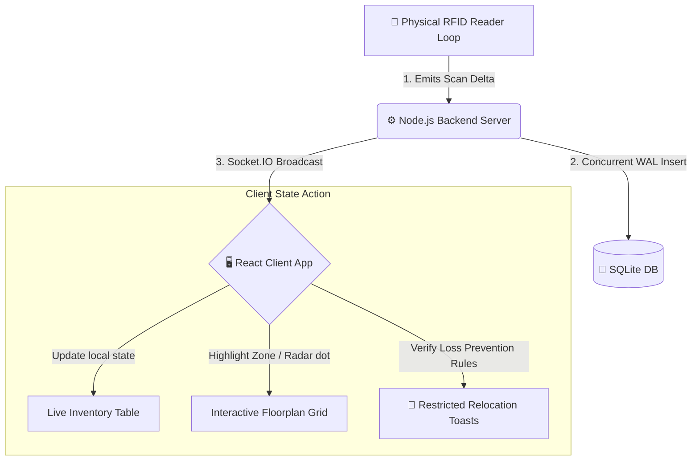

# <p align="center"> TrackTag</p>
<p align="center"><strong>Autonomous Real-Time RFID Inventory Management & Loss Prevention Engine</strong></p>

<p align="center">
  
  
  
  
</p>

<p align="center">
  <em>An elegant, low-latency, IoT-driven warehouse telemetry dashboard. Features autonomous asset tracking, predictive runout forecasting, and real-time loss prevention warnings.</em>
</p>

---

## ⚡ Core Value-Adding Features

### 🗺️ Interactive Floorplan Heatmap
* **Spatial Blueprints:** A blueprint grid mapping five facility zones: **Warehouse A, Warehouse B, Warehouse C, Showroom Floor, and Loading Dock**.
* **Visual Sweeps:** Scans flash zones with a glowing teal animation and pulse radar indicators.
* **Hover Tooltips:** Hovering over any zone raises its layout layer (`z-index: 100`) and displays a detailed tooltip card showing items inside.

### 🔍 "Find My Item" Live Locator
* **Target Radar Tracking:** Type any part of an item name into the search bar. The corresponding room immediately glows purple with an animated locator beacon (`📍`) and pulsing radar rings.

### 📊 Predictive Runout & Reorder Forecasting
* **Depletion Modeling:** SQLite stores real-time unit costs and daily depletion usage rates for all assets.
* **Proactive Warning Flags:** Computes estimated depletion dates (`Stock / Daily Consumption`) and displays alerts (e.g. `⚠️ 2 days` left) for inventory items forecast to run out within 3 to 7 days.

### 🚨 Loss Prevention & Restricted Relocations
* **Unauthorized Bay Crossings:** High-value assets like the *27" 4K Monitor* and *Standing Desk* are forbidden from entering shipping gates. If the simulation detects restricted movement, it flags it as a potential theft event.
* **Real-Time Crimson Alerts:** Emits immediate Socket.IO warning broadcasts, sliding in a compact red alert toast with independent auto-dismiss timers.

---

## 🗺️ System Architecture



---

## 📂 Project Directory Structure

<details>
<summary>📂 Click to view folder structure</summary>

```text
tracktag-mvp/
├── package.json               # Root npm concurrently script manager
├── README.md                  # Comprehensive platform documentation
├── project_checklist.md       # Artifact walkthrough and presentation scripts
├── server/                    # Node.js Backend Services
│   ├── tracktag.db            # SQLite database file
│   ├── index.js               # Main Express HTTP server & Socket.IO initialization
│   ├── db.js                  # Database schemas, column migrations, WAL setups
│   ├── seed.js                # Database seeder (inserts prices and depletion metrics)
│   ├── simulator.js           # Live RFID scan loops & loss-prevention rule checking
│   └── anomalyCheck.js        # Background inactive tag telemetry watchdog
└── client/                    # React Frontend Application
    ├── vite.config.js         # Build tooling & backend proxy configs
    ├── index.html             # Main entry point template
    └── src/
        ├── main.jsx           # Mounting entrypoint
        ├── App.jsx            # Router paths, state hooks, and socket subscriptions
        ├── socket.js          # Socket.IO client connector
        ├── styles.css         # Customized UI variable sheets and glassmorphic designs
        ├── pages/
        │   ├── Home.jsx           # Clean, minimalist landing layout
        │   ├── Dashboard.jsx      # Map controls, stock tables, and live scan logs
        │   ├── ItemDetail.jsx     # Asset spec metrics & past history trend charts
        │   ├── Analytics.jsx      # Inventory distribution dashboards
        │   ├── AlertsHistory.jsx  # DB Query tool for historic warning logs
        │   └── About.jsx          # Architecture flowcharts & roadmap
        └── components/
            └── AlertToast.jsx     # Compact, self-dismissing Toast alert items
```
</details>

---

## 🛠️ Design System & Color Tokens

Our custom design system is written in Vanilla CSS using HSL variables to support dynamic themes, smooth transitions, and high-performance animations:

```css
:root {
  /* Core Colors */
  --color-primary: #1c5d65;       /* Warm Deep Teal */
  --color-primary-light: #f3f8f9; /* Warm Light Teal */
  --color-accent: #f0ebe1;        /* Soft Sand Cream */
  --color-success: #10b981;       /* Active Emerald Green */
  --color-alert: #e05a47;         /* Warning Terracotta Red */
  --color-anomaly: #f59e0b;       /* Silent Alert Amber */

  /* Text Colors */
  --color-text-title: #2b2b2b;    /* Dark Charcoal */
  --color-text-main: #4a4a4a;     /* Soft Dark Grey */
  --color-text-muted: #8c8c8c;    /* Neutral Grey */
}
```

---

## 🚀 Commands & Getting Started

### 1. Installation
Install root, backend, and client packages:
```bash
npm run install:all
```

### 2. Launch Development Servers
Start backend (Port `4000`) and Vite frontend dev server (Port `5173`) concurrently:
```bash
npm run dev
```

* **Frontend Dashboard:** [http://localhost:5173](http://localhost:5173)
* **Backend REST API:** [http://localhost:4000](http://localhost:4000)

---

## 🧪 Live Demonstration Instructions

Follow these steps to demonstrate the platform:

1. **Test the Live Search Locator:**
   * In the top-right search box of the floorplan, type `"Mouse"`.
   * Watch **Warehouse A** instantly light up purple with a GPS pin indicator (`Warehouse A 📍`), showing exactly where that item is located.
2. **Observe Low-Stock Warning Toasts:**
   * Let the simulator run. When a high-frequency item's quantity drops below its threshold, watch the compact orange toast slide in from the bottom right.
   * Watch the toast's progress bar shrink—it will dismiss itself after exactly 6 seconds.
3. **Simulate a Silent Tag Anomaly:**
   * Click **"Simulate Anomaly"** next to *Webcam HD Pro*.
   * This immediately stops the simulator from scanning the item, making it go silent.
   * Within 5 seconds, the background watchdog detects the silence, changes the item status to **Unusual**, and adds its unit value to the **Potential Shrinkage** counter in the KPI panel.
4. **Trigger a Restricted Movement Alert (Theft Warning):**
   * If the simulator scans the *27" 4K Monitor* or *Standing Desk* into the **Loading Dock** restricted zone, watch the crimson `🚨 Restricted Movement` toast trigger immediately, warning that a high-value asset has entered a restricted bay without dispatch logs.
5. **Resolve the Anomaly:**
   * Click **"Resolve"** on the silent item.
   * The simulator resumes, the yellow highlight clears, and the shrinkage losses return to normal.

---

## 🌐 Product Expansion Roadmap

<div align="center">
  <table>
    <thead>
      <tr>
        <th>🏢 Enterprise Core Abstractions (Tier 2)</th>
        <th>✨ Future Interface & Voice Extensions (Tier 3)</th>
      </tr>
    </thead>
    <tbody>
      <tr>
        <td>
          <strong>ERP / POS Connectors:</strong> Direct integration with SAP S/4HANA, Tally Prime, and Shopify API to automatically reconcile physically read RFID stock counts against digital purchase records.
        </td>
        <td>
          <strong>Augmented Reality Spatial HUD:</strong> A mobile WebXR overlay displaying a virtual navigation line and inventory info directly onto camera feeds when scanning shelves.
        </td>
      </tr>
      <tr>
        <td>
          <strong>Multi-Tenant SaaS Infrastructure:</strong> Partitioned databases and secure portals supporting multiple companies tracking separate warehouses on a single distributed SaaS instance.
        </td>
        <td>
          <strong>Natural Language Voice Queries:</strong> Hands-free verbal stock inquiries using Web Speech APIs (e.g. <em>"What is the stock level of Wireless Mice in Warehouse A?"</em>).
        </td>
      </tr>
      <tr>
        <td>
          <strong>Offline-First Edge AI Gateway:</strong> Deploying the anomaly checking filters right onto physically connected Raspberry Pi/Impinj gateway reader devices.
        </td>
        <td>
          <strong>Gamified Staff Leaderboards:</strong> Leaderboard systems tracking staff scan verification counts and shelf order compliance rates to incentivize audit speed.
        </td>
      </tr>
    </tbody>
  </table>
</div>
