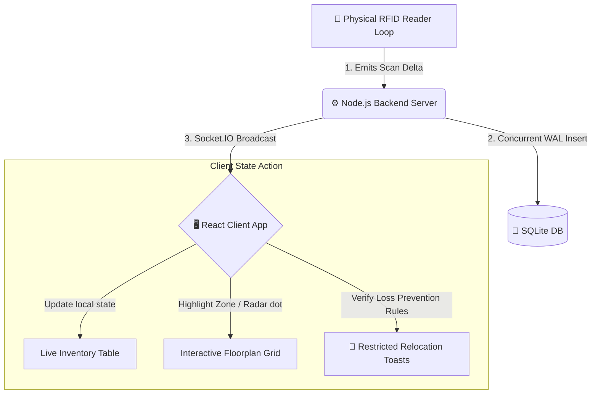

# 📡 TrackTag: Real-Time Autonomous RFID Inventory & Loss Prevention

> A premium, low-latency, IoT-driven warehouse telemetry dashboard. Autonomous asset tracking, predictive runout forecasting, and real-time loss prevention—powered by Node.js, Socket.IO WebSockets, and SQLite WAL database engine.

---

## 📖 Executive Summary
In modern logistics and retail, inventory delays and stock shrinkage represent billions in lost revenue. **TrackTag** is a real-time, autonomous inventory tracking system simulating physical RFID scanners. 

Unlike traditional passive inventory systems that rely on slow, manual database queries, TrackTag implements a **push telemetry pipeline**. As soon as an RFID reader registers a tag scan, the event is recorded in a highly concurrent database and immediately broadcasted to all connected web clients, rendering visual sweeps, predictive forecasts, and security warnings under 50 milliseconds.

---

## ⚡ Core Value-Adding Features (Tier 1)

### 1. Interactive Floorplan Heatmap
* **Spatial Blueprints:** Renders a gorgeous, custom-designed grid mapping five major facility zones: **Warehouse A, Warehouse B, Warehouse C, Showroom Floor, and the Loading Dock**.
* **Real-time Sweeps:** Telemetry events fire instant teal highlights and pulse animation cues directly inside corresponding room cells.
* **Hover Tooltips:** Hovering over any zone raises its layout layer (`z-index`) and reveals a sleek details modal listing all assets and quantities currently situated in that room.

### 2. "Find My Item" Live Locator
* **Target Radar Tracking:** Type any part of an item name into the search bar. The corresponding room immediately glows purple with an animated locator beacon (`📍`) and pulsing radar rings.

### 3. Predictive Runout & Reorder Forecasting
* **Depletion Modeling:** SQLite stores real-time unit costs and daily depletion usage rates for all assets.
* **Proactive Warning Flags:** Computes estimated depletion dates (`Stock / Daily Consumption`) and displays alerts (e.g. `⚠️ 2 days`) for inventory items forecast to run out within 3 to 7 days.

### 4. Loss Prevention & Restricted Relocations
* **Unauthorized Bay Crossings:** High-value assets like the *27" 4K Monitor* and *Standing Desk* are forbidden from entering shipping gates. If the simulation detects restricted movement, it flags it as a potential theft event.
* **Real-Time Crimson Alerts:** Emits immediate Socket.IO warning broadcasts, sliding in a compact red alert toast with independent auto-dismiss timers.

---

## 🛠️ Technology Stack & System Design

| Layer | Technology | Details / Rationale |
| :--- | :--- | :--- |
| **Frontend UI** | React 19 + Vite | Rapid, component-driven client rendering. |
| **Animations** | Framer Motion | Smooth, spring-based transitions for router changes and toast alerts. |
| **Styling** | Custom HSL Vanilla CSS | Custom design tokens using CSS Custom Properties. **Zero Tailwind, Bootstrap, or utility dependencies.** |
| **Real-time API** | Socket.IO WebSockets | Bidirectional event pipeline for scan telemetry, low-stock flags, anomalies, and theft warnings. |
| **Backend Engine** | Node.js + Express | Lightweight, fast asynchronous server handling REST and WebSocket connections. |
| **Database** | SQLite (`better-sqlite3`) | Persistent local database in **Write-Ahead Logging (WAL) Mode** for non-blocking concurrent writes. |

---

## 🗺️ System Architecture & Telemetry Data Flow



### Telemetry Workflow Steps
1. **Telemetry Event:** The simulator generates an RFID scan, modifying the stock balance (increment or depletion) in a physical zone.
2. **Database Logging:** The server updates the item's location and quantity, logs a scan record in the `scan_log` history table, and logs any warning logs in the `alert_log` table.
3. **WebSocket Broadcast:** The server pushes `scan-update`, `low-stock-alert`, `anomaly-alert`, or `theft-alert` signals.
4. **Client Render:** React listens, updates active items list, increments zone counts, triggers CSS highlights, and injects compact, auto-dismissing toasts.

---

## 📂 Project Directory Structure

```text
tracktag-mvp/
├── package.json               # Root npm concurrently script manager
├── README.md                  # Comprehensive platform documentation
├── project_checklist.md       # Artifact walkthrough and presentation scripts
├── server/                    # Node.js Backend Services
│   ├── tracktag.db            # SQLite persistent database file
│   ├── index.js               # Main Express HTTP server & Socket.IO initialization
│   ├── db.js                  # Database schemas, column migrations, WAL setups
│   ├── seed.js                # Database seeder (inserts prices and depletion metrics)
│   ├── simulator.js           # Live RFID scan loops & loss-prevention rule checking
│   └── anomalyCheck.js        # Background inactive tag telemetry watchdog
└── client/                    # React Frontend Application
    ├── vite.config.js         # Build tooling & backend proxy configs
    ├── index.html             # Main entry point template
    └── src/
        ├── main.jsx           # Mounting entrypoint
        ├── App.jsx            # Router paths, state hooks, and socket subscriptions
        ├── socket.js          # Socket.IO client connector
        ├── styles.css         # Customized UI variable sheets and glassmorphic designs
        ├── pages/
        │   ├── Home.jsx           # Clean, minimalist landing layout
        │   ├── Dashboard.jsx      # Map controls, stock tables, and live scan logs
        │   ├── ItemDetail.jsx     # Asset spec metrics & past history trend charts
        │   ├── Analytics.jsx      # Inventory distribution dashboards
        │   ├── AlertsHistory.jsx  # DB Query tool for historic warning logs
        │   └── About.jsx          # Architecture flowcharts & roadmap
        └── components/
            └── AlertToast.jsx     # Compact, self-dismissing Toast alert items
```

---

## 🚀 Execution & Command Reference

### Root Directory Commands
* **Install All Dependencies:** Installs packages for root concurrently package, server, and client apps.
  ```bash
  npm run install:all
  ```
* **Run Dev Environment:** Spins up the backend (Port `4000`) and Vite frontend dev server (Port `5173`) concurrently.
  ```bash
  npm run dev
  ```

### Client Subfolder Commands
* **Build Frontend:** Compiles production bundle assets to `dist/`.
  ```bash
  npm run build
  ```
* **Preview Build:** Launches a local server running the compiled static build.
  ```bash
  npm run preview
  ```

### Server Subfolder Commands
* **Start Backend Separately:** Launches the server database and listeners.
  ```bash
  npm start
  ```

---

## 🧪 Live Demonstration Instructions

Follow these steps to demonstrate the platform to a stakeholder:

1. **Test the Live Search Locator:**
   * In the top-right search box of the floorplan, type `"Mouse"`.
   * Watch **Warehouse A** instantly light up purple with a GPS pin indicator (`Warehouse A 📍`), showing exactly where that item is located.
2. **Observe Low-Stock Warning Toasts:**
   * Let the simulator run. When a high-frequency item's quantity drops below its threshold, watch the compact orange toast slide in from the bottom right.
   * Watch the toast's progress bar shrink—it will dismiss itself after exactly 6 seconds.
3. **Simulate a Silent Tag Anomaly:**
   * Click **"Simulate Anomaly"** next to *Webcam HD Pro*.
   * This immediately stops the simulator from scanning the item, making it go silent.
   * Within 5 seconds, the background watchdog detects the silence, changes the item status to **Unusual**, and adds its unit value to the **Potential Shrinkage** counter in the KPI panel.
4. **Trigger a Restricted Movement Alert (Theft Warning):**
   * If the simulator scans the *27" 4K Monitor* or *Standing Desk* into the **Loading Dock** restricted zone, watch the crimson `🚨 Restricted Movement` toast trigger immediately, warning that a high-value asset has entered a restricted bay without dispatch logs.
5. **Resolve the Anomaly:**
   * Click **"Resolve"** on the silent item.
   * The simulator resumes, the yellow highlight clears, and the shrinkage losses return to normal.

---

## 🌐 Product Expansion Roadmap

### Enterprise Scale (Tier 2)
* **ERP / POS Adapters:** Connect directly to APIs for Shopify, SAP S/4HANA, or Tally Prime to automatically reconcile physical counts against digital ledger bills of materials.
* **Multi-Tenant SaaS Partitioning:** Isolated tenancy tables and user roles to support different organizations on a single cloud database engine.
* **Edge AI Gateway Filters:** Move anomaly detection directly to the hardware level (e.g. Raspberry Pi RFID gateways) to maintain security during offline connectivity drops.

### Interface & Engagement (Tier 3)
* **WebXR Spatial Camera HUD:** Overlay green/red item boundaries and directions on a mobile browser feed when scanning shelves.
* **Natural Voice Queries:** hands-free verbal stock inquiries using Web Speech APIs (e.g., *"Show current inventory details for Warehouse C"*).
* **Cycle Count Leaderboards:** Team gamification widgets tracking inventory scan counts to incentivize speed.
